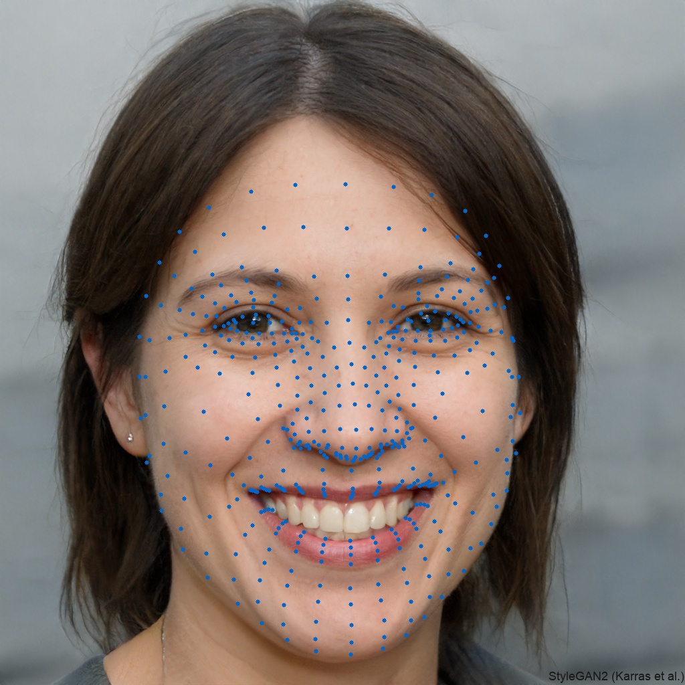

# Minimal C++ Mediapipe Face Detection and Landmarks
A lightweight C++ library for using the original Mediapipe code for face detection and face landmark extraction without having to use the Mediapipe pipeline framework.




## Table of contents
* [General info](#general-info)
* [Libraries](#libraries)
* [Setup](#setup)
* [Usage](#usage)
* [Sources](#sources)

## General info
This library uses the identical pre- and postprocessing steps as the Mediapipe framework.

The output face detection rectangles of both Mediapipe and this lightweight library are the same. <br>
Due to the original landmark model using custom tflite operators, the landmark model was replaced by a similar converted model from the PINTO_model_zoo (see [Sources](#sources)).

## Performance
On an Intel(R) Core(TM) i9-10900X CPU the landmark calculation for a single image took on average <br> 9.208 &plusmn; 3.246 ms.
	
## Libraries
This Project was created with:
* CMake version: 3.26.0
* OpenCV version: 4.6.0
* Tensorflowlite version: 2.12.0
* (Optional) Conan version: 2.0.16
	
## Setup
### OpenCV
If you do not already have OpenCV installed, download the prebuild binaries from here: https://opencv.org/releases/ <br>
Then create a new environment variable OPENCV_DIR in the system path and set it to the extracted folder <OpenCVDir\>/build/x64/vc15/lib.

### Tensorflow
On Windows with Visual Studio 2019 you can install conan (https://conan.io/) and simply run: 
```
$ conan_install.bat
```
If you use a different compiler or operating system you can update the conan files in the conan folder (https://docs.conan.io/2/reference/config_files/settings.html).

If you do not want to use a package manager you can also build it by yourself (https://www.tensorflow.org/lite/guide/build_cmake)


## Usage
To build the project, run the following command: 
```
$ cmake . -B build
```
Then you can open the project solution file FaceLandmarks.sln in the build folder and start the demo project.  

## Sources
Mediapipe: https://github.com/google/mediapipe

PINTO_model_zoo (converted landmark model model_float32.tflite): https://github.com/PINTO0309/PINTO_model_zoo/tree/main/282_face_landmark_with_attention